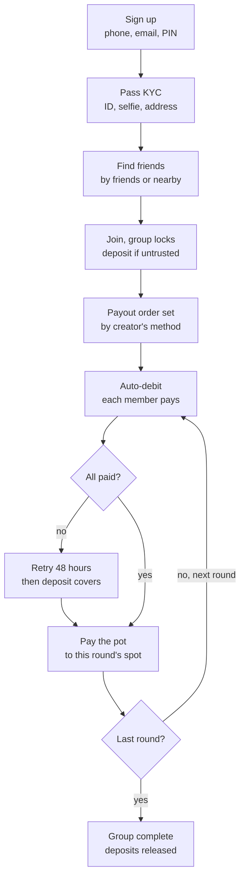

# Àjọ — Product Spec (v1)

Oct 1, 2026 · @olareign

## Overview

Àjọ is a global, mobile-first savings app for people at home and in the diaspora. It brings the traditional àjọ and èsúsú (known elsewhere as susu, chama, tontine or ROSCA) online, with verified members so people can trust each other with money across borders and currencies. Version 1 is built as a Next.js web app designed for phones, then converted to a native mobile app once it is tested.

Users save in one of two ways:

| Mode | How it works | Who receives the money |
| --- | --- | --- |
| Solo savings | The user sets an amount, a frequency (daily, weekly or monthly) and a duration (e.g. 6 weeks, 10 months). Deposits are automatic. | The user, at the end of the plan |
| Èsúsú group | A fixed number of members (e.g. 10) each pay a fixed amount every round. Each round, the whole pot goes to one member, by spot number. | Spot #1 in round 1, spot #2 in round 2, through to the last spot |

Example: 10 members pay £100 monthly for 10 months; three live in London and seven in Lagos, paying in naira at a quoted exchange rate. Each month one member receives £1,000 (less the payout fee), so by the final round every member has received the pot once.

Every user must pass KYC for their country before saving, joining or creating a group. A social layer lets users find friends, nearby people and their diaspora community to form groups with. Àjọ launches country by country, through licensed partners in each market.

## Decisions and open questions

Decided so far:

| Topic | Decision |
| --- | --- |
| Market | Global: users at home and in the diaspora; launch country by country through licensed partners |
| Platform | Next.js, mobile-first web app (PWA); native mobile app later |
| Currencies | Multi-currency; each solo plan and each group has one currency; members paying from another currency get an exchange-rate quote |
| KYC | Required before any saving: government ID for the user's country, face capture, proof of address, location, bank details; national checks such as BVN (Nigeria) optional where available |
| Payout order | Group creator picks one method: random draw at setup, members pick spots ("finger pick"), or order of joining |
| Default protection | Auto-debit required; early spots reserved for trusted members; defaulters penalised and blocked |
| Untrusted members | Must lock a deposit, released when the group ends |
| Interest | None for now; rewards must be Sharia-compatible (non-interest) |
| Revenue | A fee on each payout; a margin on currency conversion is an option; more models later |
| Codebase | New project, starting from scratch |

Open questions:

- [ ] Which countries launch first? Proposed: Nigeria plus one or two diaspora markets (e.g. UK, US or Canada).
- [ ] Can one group mix members paying in different currencies? This spec proposes yes, with an exchange-rate quote.
- [ ] Does the recipient get paid in the group currency or their own?
- [ ] Is there a third mode (group saving toward a goal, each member gets their own money back), or only solo and èsúsú? This spec assumes two.
- [ ] How much is the locked deposit for untrusted members? Proposed: one round's contribution.
- [ ] What makes a member "trusted"? Proposed: at least one group finished with no missed payments.
- [ ] Which spots count as "early"? Proposed: the first 30% (spots 1–3 in a group of 10).
- [ ] What is the payout fee? (flat amount or a percentage)
- [ ] What are the solo-savings rewards, and how are they funded?
- [ ] Can a solo saver withdraw early, and is there a penalty?
- [ ] App name and repository name

## Feature map

Ten modules make up version 1; KYC gates everything that moves money.

| Module | What it covers | Notes |
| --- | --- | --- |
| Auth and onboarding | Sign up, log in, phone and email verification, transaction PIN, password reset | Phone number as the main identity |
| KYC | Government ID for the user's country (passport, national ID, NIN, driver's licence), selfie with liveness check, proof of address, live location, bank account; national checks such as BVN (Nigeria) optional where available | Use a KYC provider; manual review for edge cases |
| Wallet and payments | Multi-currency wallet (e.g. NGN, GBP, USD, EUR, CAD), fund with local methods, auto-debit, withdraw to a local bank, exchange-rate quotes for cross-currency payments, transaction history | Funds held by licensed partners in each market |
| Solo savings | Create a plan (amount, frequency, duration), auto-deposits, progress, payout at the end | Rewards to be decided (non-interest) |
| Èsúsú groups | Create or join, rules, fill and lock, payout order, round collection, payouts, deposit lock and release | Main product; see the rules section |
| Social | Friend list of trusted people, search, invite links, mutual-friend and nearby suggestions; groups recommended by friends, mutual friends, location and diaspora community (e.g. Nigerians in London) | Nearby is opt-in and shows area only, never exact location |
| Trust | Payment history, trust score, trusted badge | Drives early-spot access and the deposit lock |
| Notifications | Payment reminders, missed payment alerts, payout alerts, group updates | Push (PWA), SMS, email |
| Defaults | Missed-payment retries, penalties, blocking, recovery case | Uses KYC details for recovery |
| Admin back office | KYC review, user and group management, disputes, defaults, transaction monitoring | Internal web dashboard |

## Èsúsú group rules

The goal of these rules: no member loses money when someone stops paying after collecting the pot.

### Setup (set by the creator)

- Currency and contribution amount per round (e.g. ₦10,000, £100 or $100)
- Frequency: weekly or monthly
- Group size (e.g. 10). The number of rounds equals the group size.
- Start date and time zone (collection dates follow the group's time zone)
- Payout-order method (see below)
- Visibility: invite-only or public (discoverable)

The group locks when every slot is filled. After locking, rules cannot change. Round 1 starts on the start date.

### Members in different countries

- Each group has one currency (e.g. GBP); every contribution and payout is counted in it.
- A member paying from another currency (e.g. NGN) sees a live exchange-rate quote and the conversion fee before paying.
- The recipient takes the pot in the group currency or converts it to their local currency.
- Members see collection times in their own time zone.
- Only users in countries where Àjọ is live can join.

### Payout order methods

| Method | How it works | Fairness safeguard |
| --- | --- | --- |
| Random draw | The system shuffles spots once the group locks | The draw is shown live to all members and its result is logged |
| Finger pick | Members pick an open spot number, first come first served | Picking opens at the same time for everyone, after the group locks |
| Join order | First to join gets spot #1, and so on | Join time is recorded and visible |

Whichever method is used, early spots are reserved for trusted members. If there are not enough trusted members to fill them, an untrusted member may take an early spot only after locking a larger deposit.

### Trust and the locked deposit

- **Trusted:** at least one group finished with no missed payments (proposed).
- **Untrusted** (new users, or anyone with a past miss): locks a deposit when joining, released after the final round if every payment was made.
- Proposed deposit: one round's contribution (e.g. ₦10,000 or £100). The amount is an open question.

### Collection and payout each round

1. Auto-debit pulls each member's contribution on the collection date.
2. A failed debit is retried for a grace period (e.g. 48 hours) and the member is notified.
3. When all contributions are in, the pot (minus the payout fee) goes to that round's spot holder.
4. Members see a live status board: who has paid, who is pending, who receives this round.

### When a member defaults

1. The grace period ends without payment: the member is marked in default.
2. Their locked deposit (if any) covers the missed contribution, so the round still pays out in full.
3. Penalty: trust score drops, the member is blocked from new groups, and a late fee applies.
4. If the deposit doesn't cover it, a recovery case opens with their KYC details.
5. Later: a protection pool funded by part of the payout fee covers any remaining shortfall.

## Key user flows

A missed payment is retried for 48 hours, then covered from the member's locked deposit, so the spot holder still receives the full pot.

Solo savings flow:

1. Pass KYC and set up an auto-debit mandate.
2. Create a plan: amount, frequency, duration.
3. Deposits are debited on schedule; missed debits are retried and the user is reminded.
4. At the end date, the balance (plus any reward) is paid to the wallet or bank.

## Core data model

Money is tracked in a double-entry ledger: every money movement is a pair of entries, and balances are calculated from entries, never stored directly.

| Entity | Key fields | Relationships |
| --- | --- | --- |
| User | phone (international format), email, name, country, time zone, language, PIN hash, status, trust score | has one KYC record, one wallet, many friendships |
| KycRecord | country, ID type and number, selfie, liveness result, address proof, location, bank account, national check such as BVN (optional), tier, status | belongs to a user |
| Wallet | currency (one wallet per currency), partner account reference | belongs to a user; has many ledger entries |
| LedgerEntry | currency, amount (in the currency's smallest unit), direction (debit or credit), type, reference, created at | belongs to a wallet; paired with another entry |
| DebitMandate | partner mandate ID, bank or card, status | belongs to a user |
| SoloPlan | currency, amount, frequency, duration, start and end dates, status | belongs to a user |
| EsusuGroup | name, currency, contribution, frequency, size, start date, time zone, order method, visibility, status (open, locked, active, completed) | has many memberships and rounds |
| Membership | spot number, trusted at join, deposit amount, deposit status, status | joins a user to a group |
| Round | number, collection date, recipient membership, status | belongs to a group; has many contributions and one payout |
| Contribution | amount, status (pending, paid, failed, covered by deposit), attempts | joins a membership to a round |
| Payout | gross amount, fee, net amount, status | belongs to a round |
| DefaultCase | amount owed, deposit applied, status | belongs to a membership |
| Friendship | requester, addressee, status | between two users |
| Notification | type, channel, payload, read at | belongs to a user |
| AuditLog | actor, action, target, details | records draws, admin actions, rule changes |

## Tech approach and partners

Build a Next.js PWA with all business logic behind an API layer, so a later React Native (Expo) app can reuse the same backend.

| Layer | Proposed choice | Why |
| --- | --- | --- |
| Frontend | Next.js (App Router), TypeScript, Tailwind, installable PWA | Mobile-first now, home-screen install, push notifications |
| API | Next.js route handlers or a separate Node service, typed with a shared schema (e.g. Zod) | The same API serves the future mobile app |
| Database | PostgreSQL with Prisma or Drizzle | Transactions and constraints for the ledger |
| Background jobs | A job queue (e.g. Inngest, Trigger.dev or BullMQ) | Scheduled debits, retries, payouts, reminders |
| Auth | Phone OTP plus PIN (e.g. Better Auth or a custom setup) | Phone-first users |
| File storage | S3-compatible storage | ID documents, selfies, address proofs |
| Hosting | Vercel for the app, managed Postgres (e.g. Neon or Supabase) | Fast to start |

Third-party partners to evaluate (prices and availability not yet checked):

| Need | Options |
| --- | --- |
| KYC (global ID documents, liveness; national checks such as NIN and BVN) | Sumsub, Onfido, Veriff, Persona (global); Smile ID, Dojah, Prembly (Africa) |
| Collections and auto-debit | Stripe and GoCardless (UK, EU, US, Canada and others); Paystack, Flutterwave, Mono (Africa) |
| Cross-border transfers and currency exchange | Wise Platform, Flutterwave, Thunes, Currencycloud |
| Holding funds (licensed) | Licensed banks or e-money institutions per market through banking-as-a-service; non-interest banks for halal rewards |
| SMS and OTP | Twilio (global), Termii and Africa's Talking (Africa) |
| AML and sanctions screening | ComplyAdvantage, or the KYC provider's built-in screening |

Regulation: holding and moving customer money is licensed in every market (e.g. CBN in Nigeria, FCA in the UK, FinCEN and state regulators in the US, central banks under PSD2 in the EU). Àjọ should operate as the technology layer, with licensed partners holding the money in each market, and launch only in countries where that is in place. Confirm with fintech lawyers in each launch market.

## Phased roadmap

Build in seven phases (0 to 6), matching the Project Plan. Each one ends with something testable by real users; timelines are set by the project manager.

| Phase | What ships | Done when |
| --- | --- | --- |
| 0. Foundations | Choose launch countries; partners per market (KYC, payments, licensed fund holders, currency exchange); legal check per market; project setup; design system | Partners signed; Next.js PWA skeleton deployed |
| 1. Identity and wallet | Auth, KYC flow, wallet, ledger, auto-debit mandate, withdrawals | A verified user can fund and withdraw with matching ledger records |
| 2. Solo savings | Plans, scheduled debits, retries, reminders, end-of-plan payout | A pilot group of users completes a short plan (e.g. 4 weeks) |
| 3. Friends and discovery | Friend list, search, invites, mutual-friend and nearby suggestions, group discovery | Users build friend lists from suggestions; nearby is opt-in and area-only |
| 4. Èsúsú groups | Create and join, all three payout-order methods, trust and deposit lock, rounds, payouts, defaults, admin back office | A pilot group of friends completes a full cycle with no manual fixes |
| 5. Launch readiness | Security test, load test, real-money pilot, support | Go-live checklist complete |
| 6. Native mobile and new countries | React Native (Expo) app on the same API; more countries added one at a time | App store release |

Rewards for solo savings and the protection pool are added once their rules are decided.
