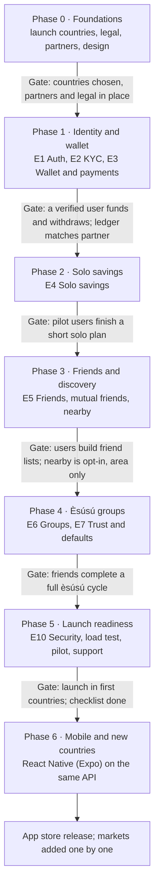

# Àjọ — Project Plan

Oct 1, 2026 · @olareign

## Scope

Version 1 delivers a global, mobile-first web app where verified users, at home or in the diaspora, can save alone or in èsúsú groups with friends, nearby people and their community, across currencies. Work is organised by feature, not by day; durations are set by the project manager.

| In version 1 | Not in version 1 |
| --- | --- |
| Launch in a first set of countries (e.g. Nigeria plus UK, US or Canada), chosen in Phase 0 | Every country at once (markets added one at a time) |
| Sign-up, login, PIN with international phone numbers | Native iOS and Android apps |
| KYC for each launch country (ID, selfie, address, location, bank; national checks such as BVN optional) | Interest-based products |
| Multi-currency wallet, auto-debit, withdrawals | Loans or credit |
| Cross-currency contributions with exchange-rate quotes | Solo savings rewards (rules not yet decided) |
| Solo savings plans | Protection pool (added once fee revenue exists) |
| Èsúsú groups with three payout-order methods, across time zones | Group chat |
| Friend list, mutual friends, nearby people, diaspora communities, group discovery |  |
| Trust score, locked deposits, default handling |  |
| Notifications (push, SMS, email); English first, more languages ready |  |
| Admin back office |  |

## Delivery approach

The plan runs in phases. Each phase holds epics, each epic holds features, and a phase ends only when its gate is met, not on a date.

- **Phase:** a major stage with a gate (e.g. Phase 3, Èsúsú groups).
- **Epic:** a large area of work (e.g. E6, Payout order).
- **Feature:** a user-visible piece of work with acceptance criteria, small enough for one developer to finish and test.

### Definition of Ready (before work starts on a feature)

- [ ] User story and acceptance criteria written
- [ ] Designs ready (mobile layout first)
- [ ] API and data changes agreed
- [ ] Dependencies done or mocked

### Definition of Done (before a feature counts as finished)

- [ ] Code reviewed and merged
- [ ] Unit and integration tests pass; money logic has full test coverage
- [ ] Works on a small Android phone screen and in slow network conditions
- [ ] Errors are logged; key events are tracked
- [ ] Tested on staging by someone other than the developer
- [ ] Docs updated (API, runbook if relevant)

## Roles and responsibilities

One person can hold several roles in a small team; each role still needs a named owner.

| Role | Owns | Signs off |
| --- | --- | --- |
| Product owner / project manager | Scope, priorities, backlog, timelines, stakeholder updates | Phase gates, go-live |
| Solution architect | Architecture, data model, integrations, security design | Technical design of each epic |
| Tech lead / senior engineer | Code quality, reviews, CI/CD, technical decisions day to day | Merges, releases |
| Frontend engineer(s) | PWA screens, components, offline and slow-network behaviour | UI features |
| Backend engineer(s) | API, ledger, jobs, integrations | Backend features |
| Product designer | User flows, mobile layouts, design system | Designs before build |
| QA engineer | Test plans, end-to-end tests, regression, pilot testing | Feature acceptance on staging |
| Compliance / legal advisor | Money and data rules in each launch market, AML, partner contracts, terms and privacy policy | Legal readiness for launch |
| Operations and support | KYC review, user support, default follow-up, reconciliation checks | Operational readiness |

## Release path

Seven phases run in order, and the public launch is the Phase 5 gate. Friends and discovery now come before èsúsú groups, so users have trusted people to form groups with.

Notifications (E8) and the admin back office (E9) are built alongside each phase as its features need them.

## Phase 0: planning and foundations

Phase 0 settles the business, legal and technical groundwork; no user-facing features ship here.

| ID | Work item | Done when |
| --- | --- | --- |
| P0.1 | Finalise product spec and open questions (deposit size, trust rule, payout fee, early-spot rule) | All open questions in the product spec have answers |
| P0.2 | Choose launch countries, then a legal and regulatory review for each (money rules, data protection, AML) | Launch countries agreed; written advice per country on operating with licensed partners |
| P0.3 | Choose and sign partners per launch country: KYC, payments and auto-debit, licensed fund holders, currency exchange and cross-border transfers, SMS | Sandbox keys for each partner; contracts in progress |
| P0.4 | Brand: name, logo, colours, tone | Brand kit approved |
| P0.5 | UX: user flows and mobile wireframes for every feature in Phase 1–3 | Clickable prototype tested with 5+ target users |
| P0.6 | Design system (colours, type, components) | Component library in the design tool |
| P0.7 | Repository, monorepo structure, coding standards | Repo created; README and contribution guide |
| P0.8 | CI/CD pipeline and environments (local, preview, staging, production) | A hello-world PWA deploys to staging through CI |
| P0.9 | Database, migrations, seed data | Schema for Phase 1 migrated on staging |
| P0.10 | Observability baseline (logging, error tracking, uptime) | Errors from staging appear in the error tracker |
| P0.11 | Terms of service and privacy policy drafts | Drafts reviewed by legal |

## Feature backlog by epic

Eleven epics cover version 1. Priority uses Must, Should and Could; every Must feature is needed for launch.

### E1. Authentication and onboarding (Phase 1)

| ID | Feature | Acceptance criteria | Depends on | Priority |
| --- | --- | --- | --- | --- |
| E1.1 | Sign up with phone (any country code) and OTP | User receives OTP by SMS, verifies, account created; OTP expires and is rate-limited | P0.3 (SMS) | Must |
| E1.2 | Profile basics | Name, email, username saved; email verified by link | E1.1 | Must |
| E1.3 | Transaction PIN | User sets a PIN; PIN required for money actions; lockout after repeated failures | E1.1 | Must |
| E1.4 | Login and sessions | OTP or PIN login; sessions expire; logout from all devices | E1.1 | Must |
| E1.5 | Device binding | New device requires OTP and notifies the user | E1.4 | Should |
| E1.6 | Onboarding screens | First-time user sees how solo and èsúsú work, then is led to KYC | E1.1 | Should |
| E1.7 | Install as app (PWA) | App installs to home screen on Android and iOS with icon and splash | P0.8 | Must |

### E2. KYC (Phase 1)

| ID | Feature | Acceptance criteria | Depends on | Priority |
| --- | --- | --- | --- | --- |
| E2.1 | ID verification | User picks their country, then enters a national ID number or uploads a passport or ID accepted there; provider confirms name and date of birth match | P0.3 (KYC) | Must |
| E2.2 | Selfie and liveness | User takes a live selfie; provider confirms liveness and face match to ID | E2.1 | Must |
| E2.3 | Proof of address | User uploads a utility bill or similar; reviewed by provider or admin | E2.1 | Must |
| E2.4 | Location capture | Location captured with consent; stored encrypted; area name derived | E2.1 | Must |
| E2.5 | Bank account | Account resolved by name; name must match KYC name | P0.3 (payments) | Must |
| E2.6 | National checks (optional) | Where a country offers one (e.g. BVN in Nigeria), the user may add it; verified by provider; raises KYC tier | E2.1 | Could |
| E2.7 | KYC status and retry | User sees status (pending, approved, rejected with reason) and can retry | E2.1–E2.5 | Must |
| E2.8 | KYC gate | Saving, joining and creating groups, and adding friends are blocked until approved | E2.7 | Must |

### E3. Wallet and payments (Phase 1)

| ID | Feature | Acceptance criteria | Depends on | Priority |
| --- | --- | --- | --- | --- |
| E3.1 | Ledger core | Double-entry postings; balances derived; every amount carries a currency, in its smallest unit; full tests | P0.9 | Must |
| E3.2 | Wallet view | Shows available, locked and savings balances per currency, and transaction history | E3.1 | Must |
| E3.3 | Fund wallet | User funds by card, bank transfer or a local method in their country; balance updates after webhook | E3.1 | Must |
| E3.4 | Auto-debit mandate | User authorises a mandate; status shown; can cancel when no active commitments | P0.3 | Must |
| E3.5 | Withdraw to bank | PIN required; transfer sent; status tracked; failures reversed in the ledger | E3.1, E2.5 | Must |
| E3.6 | Webhook inbox | All provider events stored, de-duplicated and processed by jobs | E3.1 | Must |
| E3.7 | Daily reconciliation | Ledger compared with partner report; mismatches flagged to admin | E3.1, E9.1 | Must |
| E3.8 | Limits by KYC tier | Daily and per-transaction limits enforced | E2.7 | Should |

### E4. Solo savings (Phase 2)

| ID | Feature | Acceptance criteria | Depends on | Priority |
| --- | --- | --- | --- | --- |
| E4.1 | Create plan | User sets amount, frequency, duration and start date; summary shown before confirming | E3.4 | Must |
| E4.2 | Scheduled debits | Debits run on schedule; retries on failure; user notified | E4.1, E8.1 | Must |
| E4.3 | Plan progress | Progress bar, next debit date, total saved, history | E4.1 | Must |
| E4.4 | Maturity payout | At end date, savings move to wallet or bank | E4.2 | Must |
| E4.5 | Early withdrawal | Rules to be decided (penalty or not); PIN required | E4.1 | Should |
| E4.6 | Pause or top up | User can pause a plan or add a one-off top-up | E4.1 | Could |

### E5. Friends and discovery (Phase 3)

| ID | Feature | Acceptance criteria | Depends on | Priority |
| --- | --- | --- | --- | --- |
| E5.1 | Find people | Search by phone, username or invite link; only KYC-approved users appear | E2.8 | Must |
| E5.2 | Friend requests | Send, accept, decline, cancel; both users notified | E5.1 | Must |
| E5.3 | Friend list | List of friends with trust badges; remove a friend | E5.2 | Must |
| E5.4 | Block and report | Blocked users can't see or contact each other; reports go to admin | E5.2 | Must |
| E5.5 | Mutual friend suggestions | Suggestions ranked by number of mutual friends | E5.3 | Must |
| E5.6 | Contact matching | Opt-in; contacts hashed on device; matches shown | E5.1 | Should |
| E5.7 | Nearby people | Opt-in; users within a set radius shown with area name only | E2.4 | Should |
| E5.8 | Group discovery | Public groups ranked by friends in the group, mutual friends, distance and fit | E5.5, E6.1 | Must |
| E5.9 | Invite to app | Share an invite link by WhatsApp or SMS; joining via link suggests the inviter as a friend | E5.2 | Should |

### E6. Èsúsú groups (Phase 4)

| ID | Feature | Acceptance criteria | Depends on | Priority |
| --- | --- | --- | --- | --- |
| E6.1 | Create group | Creator sets name, currency, amount, frequency, size, start date, time zone, order method, visibility, community; preview before publishing | E3.4 | Must |
| E6.2 | Invite and join | Join by invite link, from a friend's share, or from discovery; mandate required; deposit locked if untrusted | E6.1, E7.2 | Must |
| E6.3 | Group page | Rules, members with trust badges, slots left, start date | E6.1 | Must |
| E6.4 | Fill and lock | Group locks when full; rules frozen; members notified | E6.2 | Must |
| E6.5 | Random draw | Secure random order; draw shown to all members; seed and result logged | E6.4 | Must |
| E6.6 | Finger pick | Picking opens for all at once; each member picks an open spot; real-time updates; unpicked spots assigned at close | E6.4 | Must |
| E6.7 | Join order | Spots assigned by join time | E6.4 | Must |
| E6.8 | Early-spot rule | Early spots limited to trusted members; untrusted member taking one pays a larger deposit | E6.5–E6.7, E7.2 | Must |
| E6.9 | Round collection | Auto-debit for every member on collection date; status board shows who has paid | E6.4, E3.4 | Must |
| E6.10 | Payout | When the pot is full, fee deducted and payout sent to the spot holder; all members notified | E6.9 | Must |
| E6.11 | Group completion | After the last round, deposits released and group archived; trust events recorded | E6.10 | Must |
| E6.12 | Leave before lock | A member can leave before the group locks; deposit returned | E6.2 | Should |
| E6.13 | Spot swap | Two members agree to swap spots before round 1 | E6.5 | Could |

### E7. Trust and defaults (Phase 4)

| ID | Feature | Acceptance criteria | Depends on | Priority |
| --- | --- | --- | --- | --- |
| E7.1 | Trust events | On-time, late and missed payments and finished groups recorded | E6.9 | Must |
| E7.2 | Trust score and badge | Score computed from events; trusted status shown on profile and in groups | E7.1 | Must |
| E7.3 | Grace period and retries | Failed debits retried during the grace period; member reminded each time | E6.9, E8.1 | Must |
| E7.4 | Deposit covers default | After grace period, deposit covers the missed contribution; round pays in full | E7.3 | Must |
| E7.5 | Penalties and blocking | Late fee applied; defaulter blocked from new groups; trust score drops | E7.4 | Must |
| E7.6 | Recovery case | Admin case opened with amount owed and KYC details | E7.4, E9.1 | Must |

### E8. Notifications (runs across phases)

| ID | Feature | Acceptance criteria | Depends on | Priority |
| --- | --- | --- | --- | --- |
| E8.1 | Notification service | One service sends push, SMS, email and in-app from templates | P0.3 | Must |
| E8.2 | Reminders | Before each debit, on failure, before payout | E8.1 | Must |
| E8.3 | Notification centre | In-app list; mark as read | E8.1 | Should |
| E8.4 | Preferences | User chooses channels for non-critical messages | E8.1 | Could |

### E9. Admin back office (runs across phases)

| ID | Feature | Acceptance criteria | Depends on | Priority |
| --- | --- | --- | --- | --- |
| E9.1 | Admin login and roles | Separate login with two-factor; roles limit access | P0.8 | Must |
| E9.2 | KYC review queue | Approve or reject with reason; view documents through signed links | E2.7 | Must |
| E9.3 | User and group lookup | Search users and groups; view history; suspend accounts | E9.1 | Must |
| E9.4 | Default and recovery cases | Work through cases; record outcomes | E7.6 | Must |
| E9.5 | Reconciliation view | See mismatches; resolve with two-person approval | E3.7 | Must |
| E9.6 | Reports | Users, KYC pass rate, active groups, money in and out, fees, defaults | E9.1 | Should |
| E9.7 | Audit log viewer | Every admin action visible and searchable | E9.1 | Must |

### E10. Launch readiness (Phase 5)

| ID | Feature | Acceptance criteria | Depends on | Priority |
| --- | --- | --- | --- | --- |
| E10.1 | Security review and penetration test | No open high or critical findings | All Must features | Must |
| E10.2 | Load test | Debit and payout jobs handle the expected peak (e.g. month-end) without errors | E6.9 | Must |
| E10.3 | Backup and restore drill | Database restored on a separate environment and checked | P0.9 | Must |
| E10.4 | Runbooks | Written steps for provider outage, failed payouts, leaked secret, database restore | E10.3 | Must |
| E10.5 | Closed pilot | Pilot users complete solo plans and at least one full èsúsú cycle with real money | All Must features | Must |
| E10.6 | Support setup | Help centre, in-app support contact, response process | E9.3 | Must |
| E10.7 | Analytics | Key funnels tracked (sign-up to KYC to first saving) | E1, E2 | Should |

### E11. Global and multi-currency (runs across phases)

| ID | Feature | Acceptance criteria | Depends on | Priority |
| --- | --- | --- | --- | --- |
| E11.1 | Country configuration | Each country has currencies, accepted IDs, providers, limits and a live switch; a new country launches without code changes | P0.3 | Must |
| E11.2 | Multi-currency ledger and wallets | User holds balances in several currencies; ledger never mixes currencies | E3.1 | Must |
| E11.3 | Exchange-rate quotes | User sees rate, fee and expiry before any conversion | E11.2 | Must |
| E11.4 | Cross-currency contributions | A member pays a group in another currency through a quote; the pot is always in the group currency | E11.3, E6.9 | Must |
| E11.5 | Payout in local currency | Recipient chooses group currency or their own, with a quote | E11.3, E6.10 | Should |
| E11.6 | Time zones | Schedules follow the group's time zone; each user sees their own local times | E6.1 | Must |
| E11.7 | Languages and formats | Text in translation files; dates, numbers and currencies formatted for the user's locale; English first | E1.6 | Must |
| E11.8 | Diaspora communities | Users join communities (e.g. Nigerians in Manchester); groups can be tagged; discovery uses them | E5.8 | Should |
| E11.9 | AML and sanctions screening | Users screened at KYC and monitored; cross-border transfers checked; matches go to admin review | E2.7, E9.1 | Must |
| E11.10 | Limits per country | Transaction limits set per country and KYC tier | E11.1, E3.8 | Must |

## Testing and quality plan

Money logic gets the most testing: every ledger posting, round and payout path is covered by automated tests before it reaches staging.

| Test type | What it covers | When it runs |
| --- | --- | --- |
| Unit | Ledger rules, trust score, payout order, fee maths, date schedules | Every commit |
| Integration | API endpoints with a real test database; provider adapters against mocks | Every pull request |
| End-to-end | Key journeys on a phone-sized browser: sign-up to KYC, create plan, create group to payout | Every pull request (preview) and before release |
| Simulation | A full èsúsú group run with fast-forwarded time, including missed payments and defaults | Before each release touching groups |
| Provider sandbox | KYC, debits and payouts against partner sandboxes | Staging, before release |
| Security | Dependency scans, secret scans, penetration test | Continuous, plus before launch |
| Performance | Load on debit, payout and discovery endpoints | Before launch and before big marketing pushes |
| Usability | Real users in each launch country, including low-end Android phones and slow networks | Phase 0 prototype and each phase gate |
| Pilot | Real money with a small invited group | Phase 5 |

## Risk register

The biggest risks are regulatory approval and members defaulting after collecting the pot.

| Risk | Impact | Likelihood | Mitigation | Owner |
| --- | --- | --- | --- | --- |
| A regulator in a launch country objects to the operating model | High | Medium | Legal review per country in Phase 0; operate only through licensed partners; launch country by country | Product owner, legal |
| Member defaults after collecting | High | Medium | Auto-debit, early spots for trusted members, locked deposits, penalties, recovery | Architect, operations |
| Cross-border default is hard to recover | High | Medium | Larger deposits for cross-border members without history; trusted status needed for early spots | Product owner |
| Exchange rates move between quote and payment | Medium | High | Short quote expiry; pre-authorised maximum for auto-debit; group currency fixed | Architect |
| Payment partner outage or failed debits | High | Medium | Retries, second provider adapter per market, clear user messaging | Tech lead |
| KYC fraud (fake IDs, stolen identities) | High | Medium | Liveness checks, duplicate checks, sanctions screening, manual review of edge cases | Operations |
| Double debit or double payout bug | High | Low | Idempotency keys, ledger tests, reconciliation, two-person approval for fixes | Tech lead |
| Data breach of KYC data | High | Low | Encryption, private storage, least-privilege admin, penetration test | Architect |
| Nearby discovery used for scams or stalking | Medium | Medium | Opt-in, area only, KYC-only visibility, reporting and blocking | Product owner |
| Low KYC completion (users drop off) | Medium | High | Short steps, save progress, clear reasons, support | Designer |
| Partner and exchange costs higher than fee revenue | Medium | Medium | Model unit costs per country in Phase 0; adjust fees | Product owner |
| Shariah concerns about fees or rewards | Medium | Low | Fee as a service charge, not interest; non-interest partner for rewards | Product owner |

## Go-live checklist

Production opens to the public only when every item below is ticked.

**Legal and business**

- [ ] Partner contracts signed for each launch country (KYC, payments, licensed fund holders, currency exchange, SMS)
- [ ] Live API keys issued and stored in the secret manager
- [ ] Terms of service and privacy policy published
- [ ] Data protection obligations met in each launch country (privacy notice, consent, data processing records, cross-border transfers)
- [ ] Payout and exchange fees set and shown clearly in the app

**Technical**

- [ ] All Must features meet their acceptance criteria on staging
- [ ] Penetration test passed with no high or critical findings open
- [ ] Load test passed
- [ ] Backup restore drill done
- [ ] Monitoring, alerts and on-call rota live
- [ ] Runbooks written and reviewed

**Operations**

- [ ] Pilot completed with no unresolved money issues
- [ ] KYC reviewers and support staff trained
- [ ] Support channels live
- [ ] Daily reconciliation process owned by a named person

## After launch

After launch, the team runs the money operations every day and tracks a small set of numbers to decide what to build next.

Daily operations:

- Check reconciliation and resolve mismatches
- Work the KYC review queue and support tickets
- Follow up open default cases
- Review failed jobs and alerts

Success metrics (targets to be set by the product owner):

| Metric | What it shows |
| --- | --- |
| Sign-up to KYC-approved rate | Onboarding friction |
| KYC-approved to first saving rate | Activation |
| Active solo plans and active groups | Usage |
| Groups filled and locked vs created | Group demand and discovery quality |
| On-time contribution rate | Health of auto-debit and members |
| Default rate and amount recovered | Trust model effectiveness |
| Friend requests accepted; groups formed from suggestions | Value of the social layer |
| Fee revenue vs partner costs per payout | Unit economics |

Next phases after launch: new countries one at a time, and the native mobile app (React Native, Expo) on the same API, then solo rewards and the protection pool once their rules are agreed.

## Team rituals and reporting

Rituals follow features and phases, not a fixed calendar; the project manager sets the cadence.

| Ritual | Purpose | Output |
| --- | --- | --- |
| Backlog refinement | Get the next features to Definition of Ready | Ready features with acceptance criteria |
| Planning | Choose which features to work on next | Committed feature list |
| Stand-up | Progress and blockers | Blockers assigned |
| Feature demo | Show finished features on staging | Accepted or sent back |
| Phase gate review | Check the gate criteria before moving on | Go or no-go decision |
| Retrospective | Improve how the team works | Two or three actions |
| Stakeholder update | Status, risks, decisions needed | Short written update |

Tracking: each feature ID in this plan becomes one ticket in the project tracker, grouped by epic and phase.
