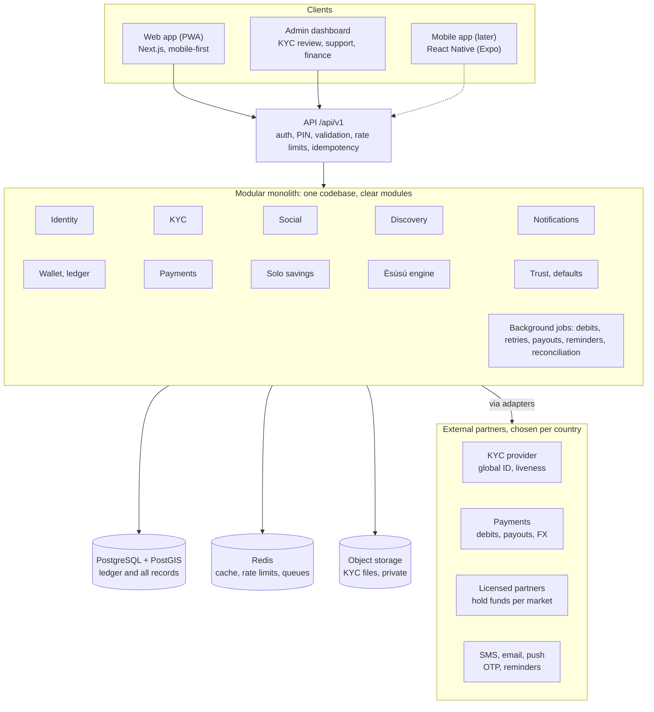

# Àjọ — Solution Architecture

Oct 1, 2026 · @olareign

## Architecture at a glance

Àjọ is one Next.js codebase with a versioned API, PostgreSQL as the source of truth, and licensed partners in each market holding customer funds, serving users at home and in the diaspora.

Every client talks only to the API; modules call partners only through adapters, so providers can be swapped without changing business logic.

## Key architecture decisions

Àjọ starts as a modular monolith in one TypeScript codebase: one deployable app, split into clear modules, so it can be split into services later if load requires it.

| # | Decision | Why | Revisit when |
| --- | --- | --- | --- |
| 1 | Next.js PWA, mobile-first | One codebase, installable on phones, fast to test with real users | Native app phase |
| 2 | Modular monolith, not microservices | A small team ships faster; module boundaries keep a later split cheap | A module needs to scale or deploy on its own |
| 3 | All business logic behind a versioned API (`/api/v1`) | The future mobile app reuses the same backend | Never; this is permanent |
| 4 | PostgreSQL as the single source of truth, with PostGIS | Transactions for money; PostGIS for nearby people and groups | Read load outgrows one primary (add read replicas) |
| 5 | Double-entry ledger; balances derived from entries | Every transaction is traceable; no silent balance drift | Never |
| 6 | Multi-currency from day one: every account and amount carries a currency; amounts in the currency's smallest unit | Diaspora users save in GBP, USD, EUR, CAD and NGN; retrofitting currency later is expensive | Never |
| 7 | Currency conversion only through explicit, quoted conversion transactions | Users see the rate and fee first; the ledger never mixes currencies | Never |
| 8 | Licensed partners hold funds in each market; Àjọ is the technology layer | Money rules differ by country (e.g. CBN, FCA, US state regulators, EU) | Àjọ gets its own licences |
| 9 | Country configuration (currencies, ID types, providers, limits, features) as data, switched on per country | New markets launch by configuration, not code rewrites | Never |
| 10 | Times stored in UTC; schedules run in each group's time zone | Members span many time zones | Never |
| 11 | Durable background jobs for every scheduled or external money action | Debits, retries and payouts must survive crashes and redeploys | Never |
| 12 | Idempotency keys on every money operation and webhook | Prevents double debits and double payouts | Never |
| 13 | Provider adapters for KYC, payments, currency exchange and SMS, routed by country | Different providers per market; swap without touching business logic | Never |
| 14 | One primary cloud region at launch; data residency reviewed per market | Simple to run; some markets may require local data storage | A market requires local data |
| 15 | Coarse location only (area, not coordinates) shown to other users | Safety in a money app | Never |

## Service modules

Each module owns its tables and exposes functions to other modules; no module writes another module's tables directly.

| Module | Owns | Key responsibilities |
| --- | --- | --- |
| Identity | users, sessions, devices, PINs | Sign-up, OTP login, PIN, device binding, session management |
| KYC | kyc\_records, kyc\_documents | Collect country-specific ID, selfie, address proof, location, bank; national checks such as BVN where available; route to the right provider per country; tiering; manual review queue |
| Social | friendships, friend\_suggestions, blocks | Friend requests, friend list, mutual friends, nearby people, blocking and reporting |
| Discovery | group\_search\_index | Recommend groups by friends in them, mutual friends, area, and group fit (amount, frequency) |
| Wallet and ledger | wallets, ledger\_accounts, ledger\_entries | Balances per currency, double-entry postings, holds (locked deposits), currency conversions, statements |
| Payments | mandates, payment\_intents, payouts, webhooks\_inbox | Auto-debit mandates, collections, transfers to bank, exchange-rate quotes, routing to the right provider per country, provider webhooks, reconciliation |
| Solo savings | solo\_plans, solo\_schedules | Plans, scheduled debits, maturity payouts |
| Èsúsú | groups, memberships, rounds, contributions, payout\_draws | Group lifecycle, payout order (draw, pick, join order), round engine, deposit lock and release |
| Trust | trust\_events, trust\_scores | Score from payment history; trusted status; early-spot eligibility |
| Defaults and recovery | default\_cases, penalties | Grace period, deposit application, penalties, blocking, recovery workflow |
| Notifications | notifications, notification\_prefs | Push, SMS, email, in-app; templates; reminders |
| Admin | admin\_users, audit\_logs | Back office: KYC review, user and group tools, disputes, reports; role-based access |

## Social graph and discovery

After KYC, users build a friend list of people they trust, and the system recommends people and groups from three signals: friends, mutual friends, and location.

### Friend list

- Friend requests are two-way: a request becomes a friendship only when accepted.
- Find people by phone number, username, invite link or QR code, and (opt-in) phone contacts. Contacts are hashed before upload and matched server-side; raw contact lists are never stored.
- Only KYC-verified users can send requests or appear in search and suggestions.
- Users can remove friends, block, and report; a block hides both users from each other everywhere.

### People suggestions

| Signal | How it is computed | Shown as |
| --- | --- | --- |
| Mutual friends | Friends-of-friends who are not yet friends, ranked by number of mutual friends | "4 mutual friends" |
| Contacts | Hashed phone numbers (international format) that match registered users | "In your contacts" |
| Nearby | Users who opted in, within a set radius (e.g. 5 km), using PostGIS distance queries | Area name only, e.g. "Peckham" or "Yaba" |
| Community | Users who opted into the same diaspora or origin community (e.g. Nigerians in Manchester) | "Also in Nigerians in Manchester" |
| Shared groups | Members of past groups who paid on time | "Was in a group with you" |

### Group discovery

Groups are ranked for each user by a weighted score:

| Factor | Example |
| --- | --- |
| Friends in the group | 2 of your friends are members |
| Mutual friends in the group | 3 members are friends of your friends |
| Distance | Group's area is within your radius |
| Community | Group is tagged with a community you joined |
| Currency | Group's currency is yours, or you can pay with an exchange-rate quote |
| Fit | Contribution amount and frequency match what you usually save |
| Group health | Creator's trust score; slots left; start date |

Only public groups and groups shared by friends appear in discovery; invite-only groups never appear.

### Location privacy

- Exact coordinates are stored only for KYC address verification, encrypted, and never shown.
- For discovery, location is snapped to a coarse cell (a geohash of about 5 km) plus the area name.
- Nearby discovery is off by default; users opt in and can turn it off at any time.
- Rate limits on search and suggestions stop scraping of users.

## Money movement

Every money action is a durable job with an idempotency key, recorded as balanced ledger entries, and reconciled daily against the partner's records.

### Ledger

- Accounts per user and currency: available, locked (deposits), and savings (per solo plan).
- System accounts per currency: group pot (one per active group), fees, currency exchange, partner settlement, suspense (unmatched money).
- Each transaction posts at least two entries whose debits equal credits in each currency; entries are never edited or deleted. Corrections are new reversing entries.
- All amounts are integers in the currency's smallest unit (kobo, pence, cents), never decimals.

### Èsúsú round engine

1. **Lock:** when the last slot fills, the group locks, payout order is fixed (draw, pick or join order) and written to the audit log, and deposits are moved from available to locked.
2. **Collect:** on the collection date, a job creates one contribution per member and requests an auto-debit for each.
3. **Settle:** provider webhooks mark contributions paid; money posts from each member to the group pot.
4. **Retry:** failed debits retry on a schedule during the grace period; the member is notified each time.
5. **Cover:** after the grace period, the member's locked deposit covers the gap and a default case opens.
6. **Pay out:** when the pot is complete, the fee posts to the fee account and the rest transfers to the spot holder's bank or wallet.
7. **Close:** after the last round, remaining deposits are released and the group is marked complete.

Random draws use a cryptographically secure generator; the seed and result are stored so any member can verify the draw.

### Reconciliation

- Daily job compares ledger totals to the partner's settlement report.
- Mismatches go to the suspense account and an admin queue; no automatic fix.
- Webhooks are stored first (inbox table), then processed, so none are lost if processing fails.

### Cross-currency and cross-border payments

1. A member paying in a different currency from the group requests a quote: rate, fee, and expiry.
2. On acceptance, one conversion transaction debits the member's currency and credits the group currency through the exchange accounts, at the quoted rate.
3. The exchange partner settles the real money between markets; reconciliation matches its report.
4. A recipient who wants their local currency gets a new quote at payout.
5. Auto-debit for cross-currency members is pre-authorised for a maximum amount, so rate changes don't cause failed payments.

## Data model

The core tables are grouped by the module that owns them. All tables carry `id` (UUID), `created_at` and `updated_at`; money columns are integers in the currency's smallest unit, always stored with a currency code.

| Module | Table | Key columns |
| --- | --- | --- |
| Identity | users | phone (international format), email, username, display\_name, country, timezone, locale, pin\_hash, status, kyc\_tier |
| Identity | devices | user\_id, device\_fingerprint, push\_token, last\_seen\_at |
| KYC | kyc\_records | user\_id, country, id\_type, id\_number (encrypted), national\_check (e.g. BVN; encrypted, optional), liveness\_result, address\_status, provider\_ref, status, reviewed\_by |
| KYC | kyc\_documents | kyc\_record\_id, type (id, selfie, address\_proof), storage\_key |
| Social | friendships | user\_a, user\_b, status (pending, accepted), requested\_by, accepted\_at |
| Social | blocks | blocker\_id, blocked\_id, reason |
| Social | user\_locations | user\_id, geohash, area\_name, point (PostGIS, coarse), discoverable |
| Social | contact\_hashes | user\_id, phone\_hash |
| Wallet | ledger\_accounts | owner\_type, owner\_id, currency, kind (available, locked, savings, pot, fees, exchange, suspense) |
| Wallet | ledger\_transactions | type, idempotency\_key, reference, status |
| Wallet | ledger\_entries | transaction\_id, account\_id, currency, amount, direction |
| Payments | mandates | user\_id, provider, provider\_ref, bank\_or\_card, status |
| Payments | payment\_intents | kind (debit, payout), currency, amount, country, provider, provider\_ref, idempotency\_key, status, attempts |
| Payments | webhook\_inbox | provider, event\_id, payload, processed\_at |
| Solo | solo\_plans | user\_id, currency, amount, frequency, start\_date, end\_date, status |
| Èsúsú | esusu\_groups | creator\_id, name, currency, contribution, frequency, size, start\_date, timezone, community, order\_method, visibility, area\_name, geohash, status |
| Èsúsú | memberships | group\_id, user\_id, spot, trusted\_at\_join, deposit\_amount, deposit\_status, status |
| Èsúsú | rounds | group\_id, number, collection\_date, recipient\_membership\_id, status |
| Èsúsú | contributions | round\_id, membership\_id, amount, status, payment\_intent\_id |
| Èsúsú | payout\_draws | group\_id, method, seed, result, created\_at |
| Trust | trust\_events | user\_id, kind (paid\_on\_time, late, missed, group\_completed), weight |
| Trust | trust\_scores | user\_id, score, trusted, computed\_at |
| Defaults | default\_cases | membership\_id, amount\_owed, deposit\_applied, status |
| Notifications | notifications | user\_id, kind, channel, payload, sent\_at, read\_at |
| Admin | audit\_logs | actor\_id, action, target\_type, target\_id, details |

Tables added for global support:

| Module | Table | Key columns |
| --- | --- | --- |
| Config | countries | code, currencies, id\_types, kyc\_provider, payment\_provider, limits, live |
| Payments | fx\_quotes | from\_currency, to\_currency, amount, rate, fee, expires\_at, status |
| Wallet | fx\_conversions | quote\_id, ledger\_transaction\_id, partner\_ref |
| Social | communities | name, country\_of\_origin, city, member\_count |
| Social | community\_members | community\_id, user\_id |

## API surface

A REST API under `/api/v1`, JSON in and out, with request and response schemas shared between server and client. Money-changing endpoints require the transaction PIN and an `Idempotency-Key` header.

| Area | Endpoints |
| --- | --- |
| Auth | `POST /auth/otp/request`, `POST /auth/otp/verify`, `POST /auth/pin`, `POST /auth/refresh`, `POST /auth/logout` |
| Profile | `GET /me`, `PATCH /me`, `GET /users/{id}` (public profile) |
| KYC | `POST /kyc/start`, `POST /kyc/documents`, `POST /kyc/selfie`, `POST /kyc/address`, `POST /kyc/bank`, `GET /kyc/status` |
| Friends | `GET /friends`, `POST /friends/requests`, `POST /friends/requests/{id}/accept`, `DELETE /friends/{id}`, `POST /blocks`, `POST /reports` |
| Discovery | `GET /users/search?q=`, `GET /suggestions/people`, `GET /suggestions/groups`, `POST /contacts/match`, `PUT /me/location` |
| Wallet | `GET /wallet`, `GET /wallet/transactions`, `POST /wallet/fund`, `POST /wallet/withdraw` |
| Mandates | `POST /mandates`, `GET /mandates`, `DELETE /mandates/{id}` |
| Solo | `POST /solo-plans`, `GET /solo-plans`, `GET /solo-plans/{id}`, `POST /solo-plans/{id}/cancel` |
| Groups | `POST /groups`, `GET /groups/{id}`, `POST /groups/{id}/join`, `POST /groups/{id}/leave`, `POST /groups/{id}/invites`, `POST /groups/{id}/spots/{n}/pick`, `GET /groups/{id}/rounds`, `GET /groups/{id}/draw` |
| Notifications | `GET /notifications`, `POST /notifications/read`, `PUT /notification-prefs` |
| Webhooks | `POST /webhooks/{provider}` (signature-verified) |
| Admin | `/admin/*`: KYC queue, users, groups, default cases, reconciliation, audit logs |

Global additions: `GET /countries` (live countries, currencies, accepted ID types), `GET /fx/quote`, `POST /fx/convert`, `GET /communities`, `POST /communities/{id}/join`, and country, time zone and language on `PATCH /me`.

Real-time updates (spot picking, round status board) use server-sent events or a hosted real-time service.

## Third-party integrations

Each integration sits behind an adapter interface, so a second provider can be added as a fallback. Pricing and availability have not been checked yet.

| Need | Candidates | Adapter interface |
| --- | --- | --- |
| Identity checks (global ID documents, liveness; NIN and BVN in Nigeria) | Sumsub, Onfido, Veriff, Persona (global); Smile ID, Dojah, Prembly (Africa) | `verifyId`, `verifySelfie`, `verifyNationalCheck`, `verifyAddress` |
| AML and sanctions screening | ComplyAdvantage, or the KYC provider's built-in screening | `screenPerson`, `monitorPerson` |
| Collections and auto-debit | Stripe, GoCardless (UK, EU, US, Canada and more); Paystack, Flutterwave, Mono (Africa) | `createMandate`, `chargeMandate`, `verifyWebhook` |
| Payouts to bank | Stripe, Wise Platform, Paystack Transfers, Flutterwave Transfers | `resolveAccount`, `transfer`, `getTransferStatus` |
| Currency exchange and cross-border transfers | Wise Platform, Flutterwave, Thunes, Currencycloud | `quote`, `convert`, `getSettlementReport` |
| Fund holding (licensed, per market) | Licensed banks or e-money institutions via banking-as-a-service; non-interest banks for halal rewards | `createAccount`, `getBalance`, `getSettlementReport` |
| SMS and OTP | Twilio (global); Termii, Africa's Talking (Africa) | `sendOtp`, `sendSms` |
| Email | Resend, Postmark | `sendEmail` |
| Push | Web Push (VAPID) now; Firebase Cloud Messaging for native | `sendPush` |
| Maps and areas | OpenStreetMap or Google Maps geocoding | `reverseGeocode` (coordinates to area name) |

## Security, privacy and compliance

Treat Àjọ as a financial system from day one: encrypted personal data, strong login, full audit trail, and regulatory review before launch.

| Area | Controls |
| --- | --- |
| Authentication | Phone OTP, 4–6 digit transaction PIN, device binding, short-lived access tokens with rotating refresh tokens, lockout after failed attempts |
| Authorisation | Users can only read and act on their own records and groups they belong to; admin roles (support, KYC reviewer, finance, super admin) with least privilege |
| Data protection | TLS everywhere; ID numbers, BVN and exact location encrypted at field level; KYC files in a private bucket with short-lived signed URLs |
| Money safety | PIN and idempotency key on every money action; limits per KYC tier; velocity checks; two-person approval for manual admin adjustments |
| Fraud and abuse | Rate limits, duplicate-identity checks, device fingerprinting, flags for many accounts on one device, reports and blocks |
| Audit | Every admin action, draw, rule change and money action written to an append-only audit log |
| Secrets | Stored in the hosting platform's secret manager; never in code; rotated on staff changes |
| App security | Input validation on every endpoint, CSRF protection, security headers (CSP), dependency scanning, yearly penetration test before and after launch |
| Compliance | Data protection law in every market: GDPR (EU), UK GDPR, Nigeria Data Protection Act 2023, US state laws such as CCPA; money rules through licensed partners per market (e.g. CBN, FCA, FinCEN and state regulators); AML checks and sanctions screening on users and cross-border transfers; PCI DSS handled by the payment provider (no card data stored) |
| Data retention | KYC and transaction records kept for the period each market's regulator and partner require; cross-border data transfers covered by approved legal mechanisms; account deletion removes profile and social data |

## Environments, CI/CD and deployment

Four environments; code moves forward only through pull requests and automated checks.

| Environment | Purpose | Data | Providers |
| --- | --- | --- | --- |
| Local | Developer machines | Seed data, Docker Postgres | Provider sandboxes or mocks |
| Preview | One per pull request | Seed data on a database branch | Sandboxes |
| Staging | Full end-to-end testing, pilot rehearsals | Anonymised or test data | Sandboxes |
| Production | Live users | Real data, backups | Live keys |

Pipeline on every pull request:

1. Install, type-check, lint, format check
2. Unit and integration tests (with a test database)
3. Build
4. Dependency and secret scanning
5. Preview deploy and end-to-end tests against it

On merge to `main`: deploy to staging, run database migrations, run smoke tests. Production deploys are a manual promotion of a tested staging build. Migrations are backwards-compatible so a deploy can be rolled back without a database rollback.

## Observability, reliability and scaling

The system must never lose or duplicate money, even if it is slow or partly down.

| Area | Approach |
| --- | --- |
| Logging | Structured JSON logs with a request ID on every line; personal data redacted |
| Errors | Error tracking with alerts to the on-call channel |
| Metrics and alerts | Debit success rate, payout success rate, webhook lag, job queue depth, reconciliation mismatches, API latency and error rate |
| Uptime | External checks on the app and key endpoints; public status page |
| Jobs | Every job retries with backoff; failed jobs land in a dead-letter queue for review |
| Backups | Managed point-in-time recovery for Postgres; daily snapshot copied to a second region; restore drill before launch and regularly after |
| Disaster recovery | Written runbooks for provider outage, database restore, leaked secret, and failed payout batch |
| Scaling | Stateless app servers scale horizontally; database read replicas for discovery queries; cache (Redis) for suggestions and rate limits; one cloud region at launch, more regions as markets require |

## Path to the native mobile app

The mobile app is a new client on the same API; no backend rewrite is needed.

1. Keep shared code (API schemas, types, validation, formatting helpers) in a shared package from the start.
2. Use a monorepo: `apps/web` (Next.js), `apps/admin`, later `apps/mobile` (Expo), and `packages/*` for shared code.
3. Auth uses tokens that work outside the browser (not cookie-only), so mobile can use the same endpoints.
4. Swap Web Push for Firebase Cloud Messaging and Apple push; add native camera for KYC selfies and biometrics for PIN.
5. Run the PWA and native app side by side until native reaches feature parity.
